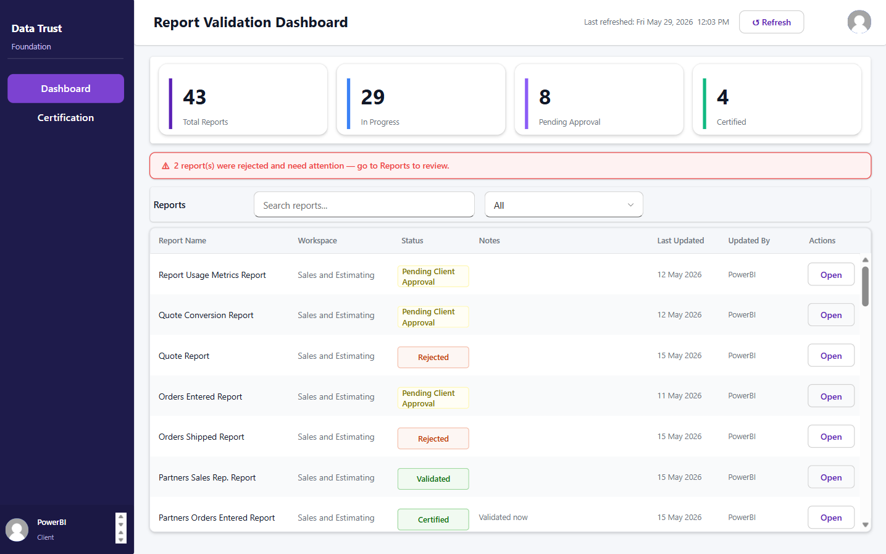
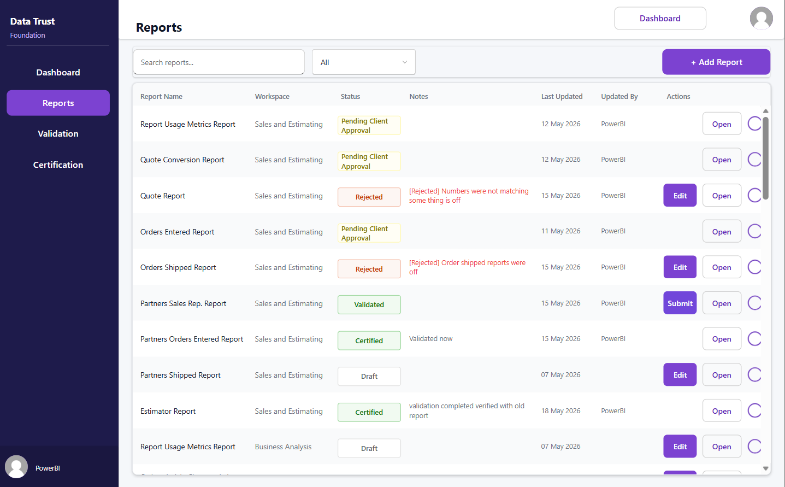
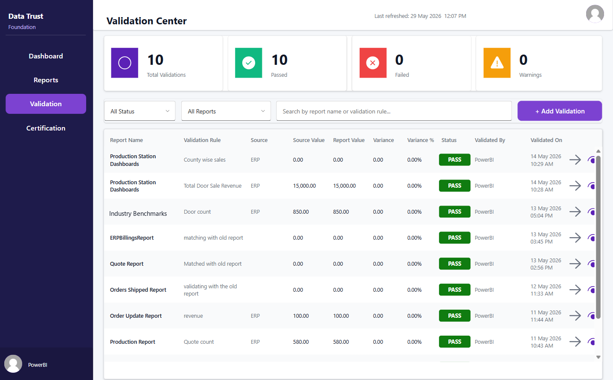
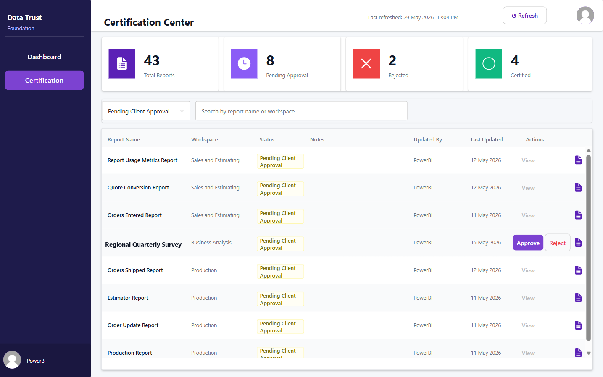
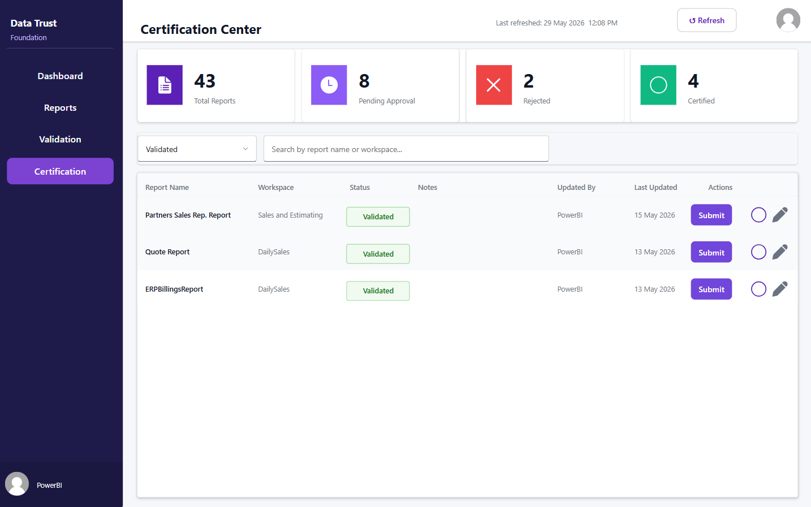

# Data Trust Foundation — Report Governance App

A Power Apps Canvas app that manages the full **report validation and certification lifecycle** — from a developer running data validations to a client formally approving (or rejecting) a report as certified.

> **Client engagement.** Built as a production solution for a client in the commercial door & hardware manufacturing industry. Report names, workspaces, and user labels shown in the screenshots are anonymized sample data.

## Overview

When business reports drive decisions, "is this report trustworthy?" needs a real answer. This app gives that answer a defined, auditable workflow with two audiences:

- **Internal developers** — register reports, run reconciliation validations against source systems, and submit reports for client approval.
- **Clients** — review the validations behind a report and formally **Approve** or **Reject** its certification.

## Status Lifecycle

```
Draft → Under Review → Validated → Pending Client Approval → Certified / Rejected
```

Every transition is written to an audit history table.

## Key Features

- **Role-based experience** — Developer vs. Client views are driven by a user registry; navigation and actions adapt to the signed-in role.
- **Validation center** — record reconciliation checks (source value vs. report value, variance, variance %, PASS / FAIL / WARN) per report.
- **Certification workflow** — developers submit validated reports; assigned clients approve or reject with reasons.
- **Rejection with flagged validation** — when a client rejects, they flag which validation looked wrong (or "Other" + a reason); developers get a detail view of the rejection.
- **Workspace-scoped access** — clients see only reports in workspaces they're assigned to, with Approver vs. Viewer action rights.
- **Audit history** — every status change is logged (who, when, from → to, notes).
- **Email notifications** — a Power Automate flow notifies the assigned client when a report is submitted for approval.

## Tech Stack

- **Power Apps** (Canvas app, role-aware multi-screen)
- **SQL Server** (governance tables + audit history)
- **Power Automate** (approval notification emails)

## Screenshots

| Dashboard | Reports | Validation Center |
|---|---|---|
|  |  |  |

| Certification — pending approval | Certification — validated |
|---|---|
|  |  |

## Data Model

Full schema in [`sql/database-architecture.md`](sql/database-architecture.md). Core tables:

| Table | Purpose |
|---|---|
| `tbl_reports` | Report inventory, lifecycle status, approval metadata |
| `tbl_validation_results` | Reconciliation records (source vs. report values, variance, result) |
| `tbl_certification` | Certification records, including flagged validations on rejection |
| `tbl_users` | Role-based access (Developer / Client) |
| `tbl_user_workspaces` | Client → workspace access and Approver/Viewer action role |
| `tbl_report_history` | Full audit timeline of status transitions |

---

*Screenshots use anonymized sample data. Internal connection identifiers have been omitted.*
